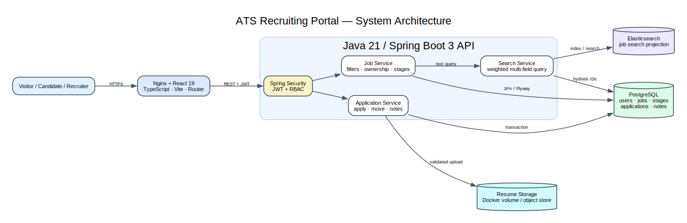

# ATS Recruiting Portal Architecture

This package explains the public careers, candidate, and recruiter workflows implemented by the React application and Spring Boot API.

## Read in this order

1. [High-level design](HLD.md) — service boundaries, persistence, search, security, and deployment.
2. [Primary sequence](SEQUENCE.md) — candidate application and recruiter pipeline movement.
3. [System diagram source](diagrams/system-architecture.dot) — editable Graphviz source.
4. [Sequence diagram source](diagrams/application-sequence.dot) — editable Graphviz source.

## Code map

| Area | Implementation |
|---|---|
| React routes and screens | `frontend/src/pages`, `frontend/src/App.tsx` |
| API client and auth state | `frontend/src/api`, `frontend/src/auth` |
| Authentication | `backend/.../auth`, `SecurityConfiguration` |
| Job lifecycle and filtering | `backend/.../job` |
| Applications and stages | `backend/.../application` |
| Full-text role search | `backend/.../search` |
| Relational schema | `backend/src/main/resources/db/migration` |
| Local runtime | `compose.yaml` |
