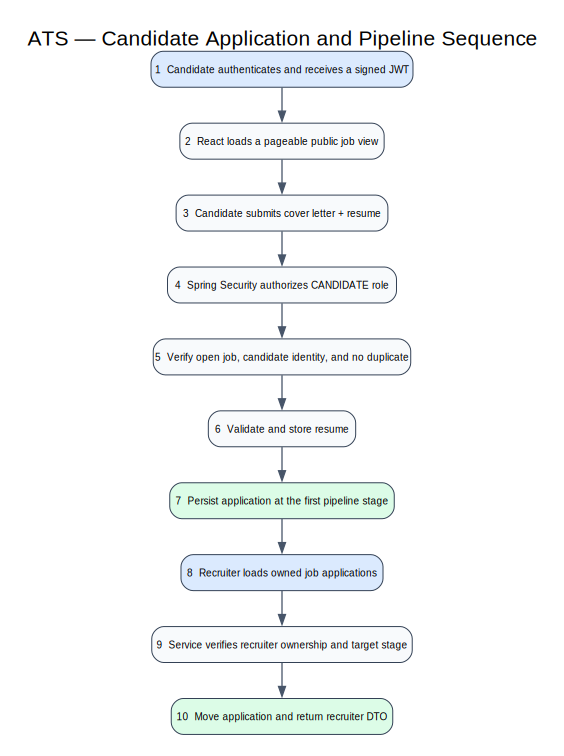

# Candidate Application Sequence

## Candidate applies

1. The candidate signs in and receives a signed JWT.
2. React requests an open job and submits the cover letter and resume.
3. Spring Security authenticates the candidate role.
4. `ApplicationService` loads the candidate and detailed job, verifies the job is open, and rejects duplicate applications.
5. `ResumeStorage` validates and persists the uploaded file.
6. PostgreSQL creates the application at the job's first stage.
7. The API returns a DTO without recruiter-only notes.

## Recruiter advances the candidate

1. The recruiter opens the job pipeline and requests its applications.
2. The service verifies the recruiter owns the job.
3. A stage-move request verifies that the target stage belongs to the same job.
4. JPA updates the application in one transaction and returns the recruiter view.

## Failure behavior

- Closed jobs and duplicate applications fail before persistence.
- Candidate tokens cannot call recruiter routes.
- Recruiters cannot view or mutate applications for jobs they do not own.
- Elasticsearch unavailability affects text search, not authoritative application state.
